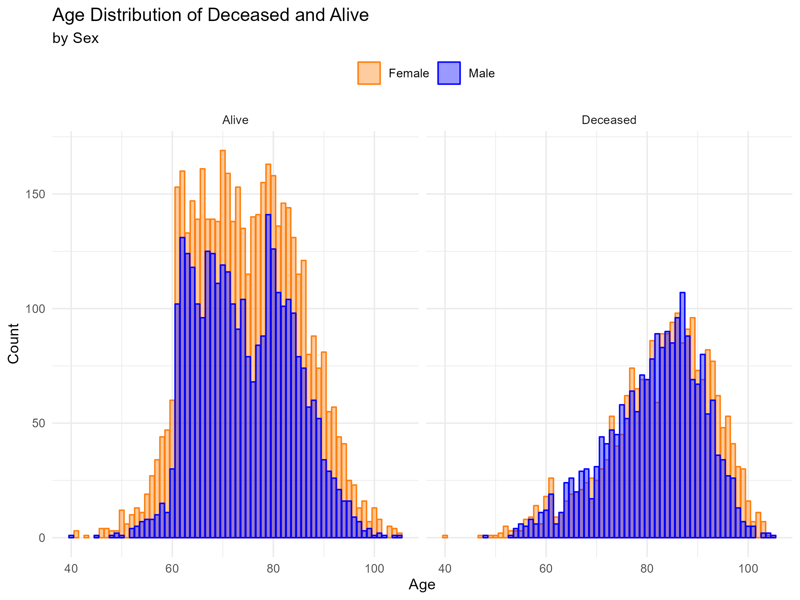
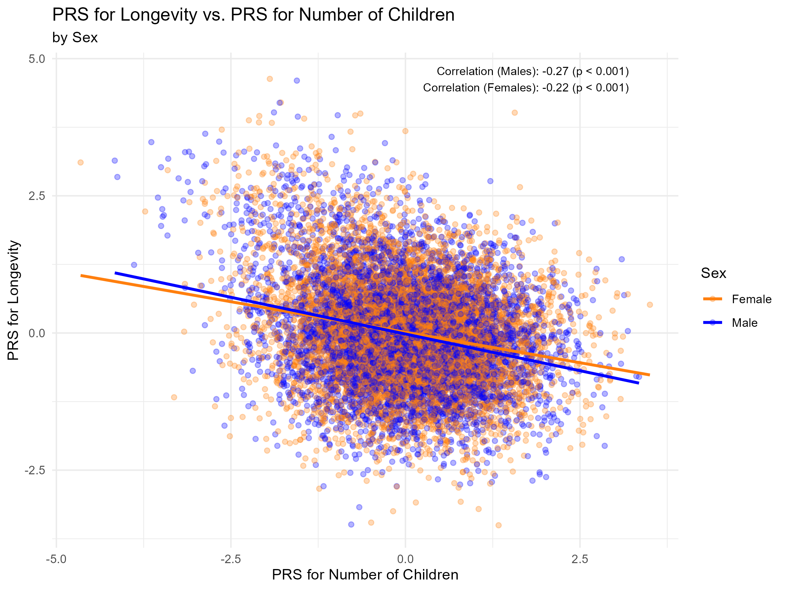
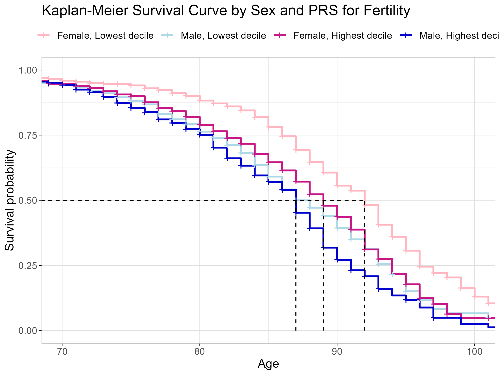
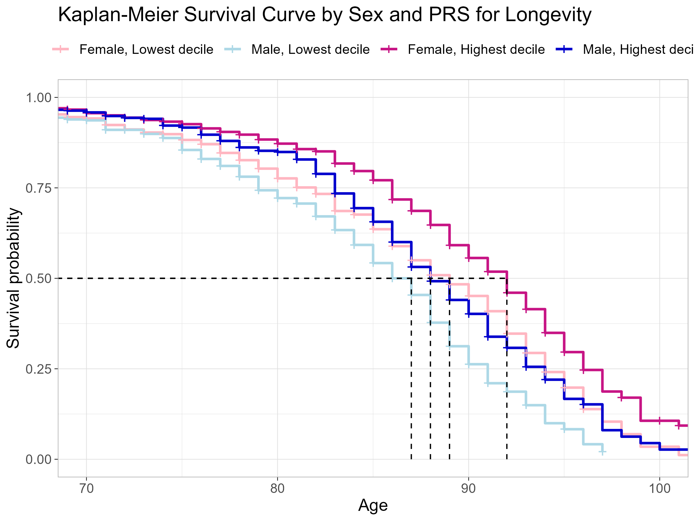

# Investigating the Genetic and Behavioral Components of the Fertility-Longevity Trade-Off

## Description
This project explores the evolutionary trade-off between fertility and longevity, focusing on how genetic, demographic, and socio-behavioral factors shape human lifespan. Using survival analysis techniques and polygenic risk scores, the study delves into the complex interplay of reproductive behavior, genetic predispositions, and socio-demographic factors.

## Key Features
- **Data-Driven Insights**: Analyze the relationships between fertility, longevity, and socio-demographic variables.
- **Genetic Factors**: Use polygenic risk scores to assess predispositions for longevity and fertility.
- **Statistical Methods**: Kaplan-Meier survival analysis and Cox proportional hazards models.
- **Visual Outputs**: A range of plots and tables for exploratory analysis and result visualization.

---

## Folders Structure
- **`raw/`**: Contains raw datasets used as input for the analysis.  
  - Files: `pgenscore4e_r.dta`, `randhrs1992_2020v1.dta`, `trk2020tr_r.dta`

- **`data/`**: Stores pre-processed datasets for faster analysis.  
  - Files: `df.RData`, `df_f.RData`, `df_m.RData`

- **`doc/`**: Documentation related to the raw datasets.

- **`output/`**: Contains all generated plots, tables, and results, including survival curves, scatterplots, and model outputs.  

- **`program/`**: Contains all R scripts, optimized for sequential execution:
  1. `00_data_manipulation.R` (Optional): Prepares pre-processed datasets.  
     *Note: Loading raw data takes approximately 15 minutes. This script can be skipped as the following scripts are optimized for pre-processed datasets.*
  2. `01_summary_statistics.R`: Produces summary statistics tables for numeric and categorical variables.
  3. `02_data_exploration.R`: Generates scatterplots, density plots, and bar charts for exploratory data analysis.
  4. `03_kaplan_meier.R`: Creates Kaplan-Meier survival curves and computes median survival times.
  5. `04_cox_models.R`: Fits Cox proportional hazards models and visualizes their results.

---

## Visual Highlights
### Age Distribution


### Scatterplot Polygenic Risk Scores


### Kaplan-Meier Survival Curves
  
  
---

## Getting Started
### Prerequisites
Ensure you have the following installed:
- R (>= 4.0.0)
- Required R packages (see `program/00_data_manipulation.R` for dependencies).

### Running the Analysis
1. Clone the repository:
   ```bash
   git clone https://github.com/chiara-cattani/Genetic-Fertility-Longevity-Trade-Off.git
   cd Genetic-Fertility-Longevity-Trade-Off
